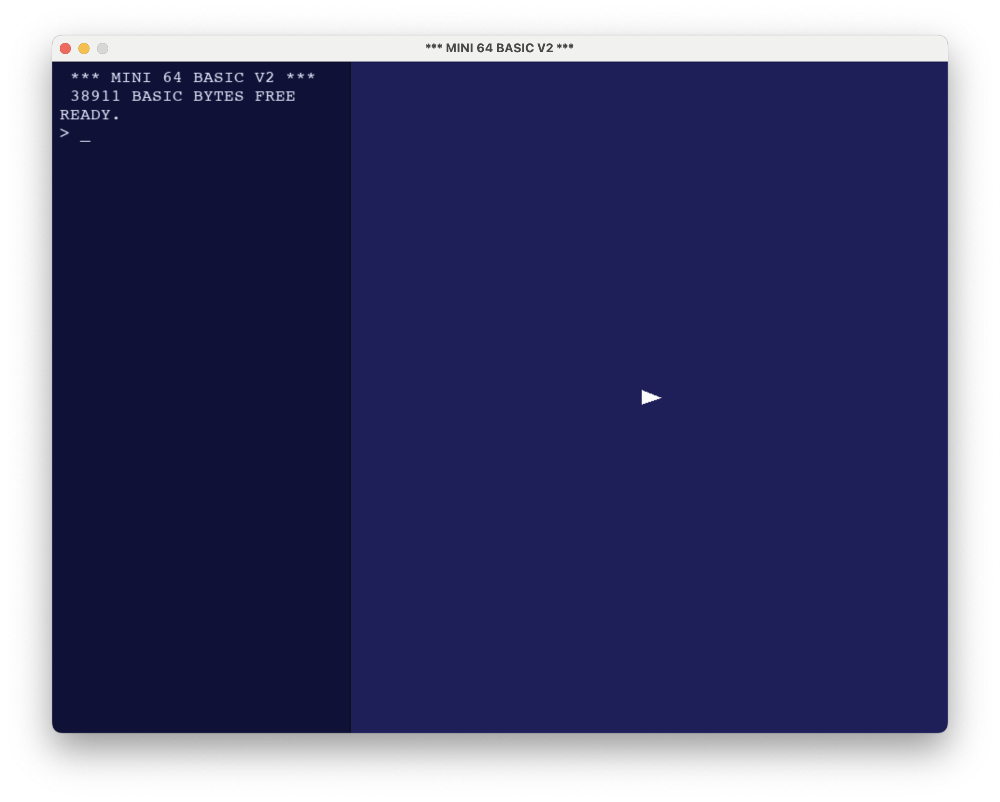
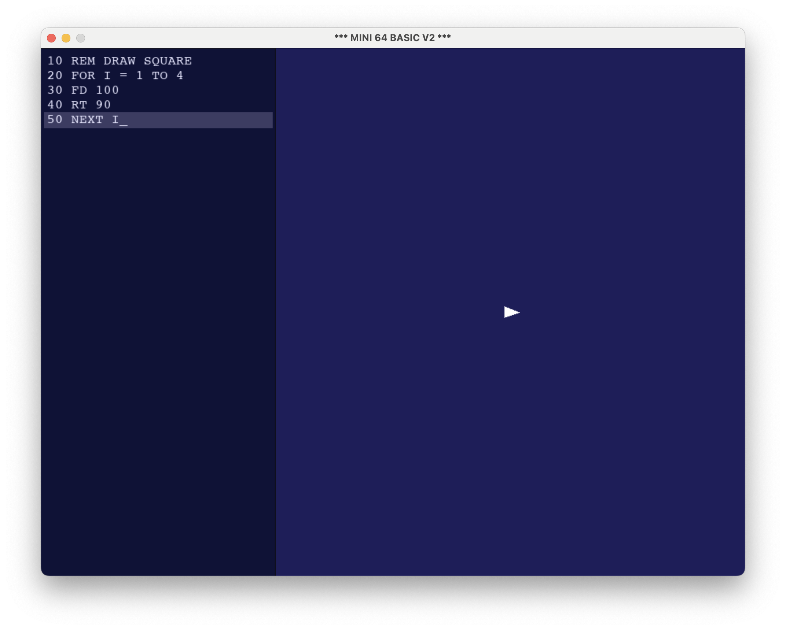
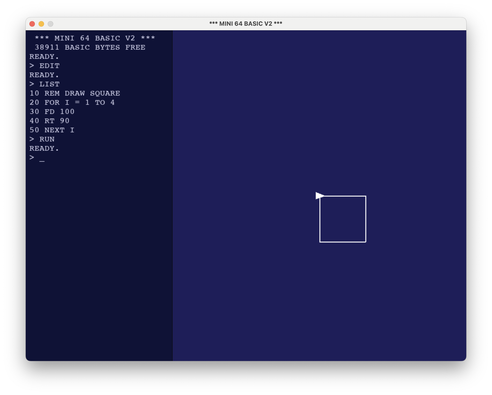

# Mini 64 BASIC V2

A nostalgic BASIC interpreter with turtle graphics, inspired by the Commodore 64. Features a dual-pane interface with console/editor on the left and graphics canvas on the right.

## Installation

```bash
pip install pygame-ce
python mini64.py
```

## Screenshots

### Startup Interface

*The main interface showing the console with turtle cursor positioned in the center of the graphics canvas*

### Edit Mode

*Program editor with syntax highlighting and auto line numbering for writing BASIC programs*

### Graphics Output

*Turtle graphics in action - completed square drawing with turtle cursor showing final position and heading*

## Interface

- **Left Pane**: Console and program editor
- **Right Pane**: Graphics canvas with turtle cursor
- **ESC**: Toggle between console and edit modes
- **Edit Mode**: Ctrl+Enter or F5 to run program
- **Arrow Keys**: Navigate history (console) or cursor (edit mode)

## Turtle Cursor

- **Filled Triangle**: Pen down (draws when moving)
- **Outline Triangle**: Pen up (moves without drawing)
- Triangle points in current heading direction

## Command Reference

### Program Management
| Command | Description | Example |
|---------|-------------|---------|
| `EDIT` | Enter program editor mode | `EDIT` |
| `LIST` | Show current program | `LIST` |
| `RUN` | Execute the program | `RUN` |
| `NEW` | Clear program and variables | `NEW` |

### File Operations
| Command | Description | Example |
|---------|-------------|---------|
| `SAVE "name"` | Save program to file | `SAVE "DEMO"` |
| `LOAD "name"` | Load program from file | `LOAD "DEMO"` |
| `DIR` / `FILES` | List saved .bas files | `DIR` |

### Variables & Logic
| Command | Description | Example |
|---------|-------------|---------|
| `LET var = value` | Set variable | `LET X = 10` |
| `PRINT value` | Print value or string | `PRINT "HELLO"` |
| `PRINT variable` | Print variable value | `PRINT X` |
| `REM comment` | Comment line | `REM THIS IS A COMMENT` |
| `END` | Stop program execution | `END` |

### Control Flow
| Command | Description | Example |
|---------|-------------|---------|
| `GOTO line` | Jump to line number | `GOTO 100` |
| `FOR var = start TO end` | Start loop | `FOR I = 1 TO 10` |
| `FOR var = start TO end STEP n` | Loop with custom step | `FOR I = 10 TO 1 STEP -1` |
| `NEXT` | End loop (innermost) | `NEXT` |
| `NEXT var` | End specific loop | `NEXT I` |

### Turtle Movement
| Command | Description | Example |
|---------|-------------|---------|
| `FD distance` | Move forward | `FD 50` |
| `BK distance` | Move backward | `BK 30` |
| `RT angle` | Turn right (degrees) | `RT 90` |
| `LT angle` | Turn left (degrees) | `LT 45` |
| `GO x y` | Move to coordinates | `GO 100 200` |

### Pen Control
| Command | Description | Example |
|---------|-------------|---------|
| `PU` | Pen up (don't draw) | `PU` |
| `PD` | Pen down (draw lines) | `PD` |
| `PEN color` | Set pen color | `PEN RED` |
| `THICK width` | Set line thickness | `THICK 5` |

### Graphics
| Command | Description | Example |
|---------|-------------|---------|
| `CIRCLE radius` | Draw circle at current position | `CIRCLE 25` |
| `BG color` | Set background color | `BG BLUE` |

### Colors
Available colors: `BLACK`, `WHITE`, `RED`, `GREEN`, `BLUE`, `YELLOW`, `CYAN`, `MAGENTA`, or numbers `0`-`15`

## Example Programs

### Simple Square
```basic
10 REM DRAW A SQUARE
20 FOR I = 1 TO 4
30 FD 100
40 RT 90
50 NEXT I
```

### Colorful Spiral
```basic
10 PEN RED
20 FOR I = 1 TO 50
30 FD I * 2
40 RT 91
50 NEXT I
```

### Circle Pattern
```basic
10 FOR A = 0 TO 360 STEP 30
20 RT 30
30 FD 50
40 CIRCLE 20
50 BK 50
60 NEXT A
```

## Features

- **Nested FOR loops** with proper variable matching
- **Auto line numbering** in edit mode (increments by 10)
- **Immediate mode** - execute commands directly in console
- **Program persistence** - save/load programs as .bas files
- **Variable support** - integers, floats, and hexadecimal (0x prefix)
- **C64-inspired color palette** and retro styling
- **Real-time turtle cursor** showing position and heading

## Tips

- Use `EDIT` to write multi-line programs with auto-numbering
- Press ESC to switch between console and edit modes
- The turtle starts at screen center, heading east (0°)
- Use `PU` and `PD` to control whether movement draws lines
- Variables are case-insensitive and global
- Line numbers help with `GOTO` and program organization